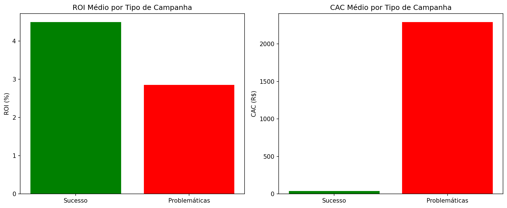

# 📊 Projeto 4: Análise de Marketing - CAC, ROI e Retenção


---

## 📋 **Descrição do Projeto**

Este é o **quarto projeto** do meu portfólio de análise de dados, desenvolvido durante o curso **Santander + DIO**. O objetivo foi analisar campanhas de marketing para calcular CAC (Custo de Aquisição), ROI (Retorno sobre Investimento) e identificar oportunidades de otimização.

**Base de dados:** 10.000 registros de campanhas de marketing, incluindo métricas de orçamento, conversões, receita e retenção de clientes.

---

## 🎯 **Principais Descobertas**

### **Comparação entre Campanhas de Sucesso vs. Problemáticas**

| Métrica | Campanhas de Sucesso | Campanhas Problemáticas | Impacto |
|---------|---------------------|------------------------|---------|
| **ROI Médio** | 4.5% | 2.8% | Sucesso é **60% melhor** |
| **CAC Médio** | R$ 41 | R$ 2.289 | Problemático é **55x mais caro** |
| **Budget Médio** | R$ 23 mil | R$ 33 mil | Problemático gasta **43% mais** |
| **Conversões Médias** | 616 clientes | 33 clientes | Sucesso gera **18x mais clientes** |

### **Quantidade de Campanhas**
- **Campanhas de Sucesso (ROI > 4% e CAC < R$ 100):** 1.652 campanhas
- **Campanhas Problemáticas (CAC > R$ 500):** 512 campanhas
- **Total de campanhas analisadas:** 10.000

---

## 💡 **Insights Estratégicos**

### **1. O Problema é Grave**
- Campanhas problemáticas gastam **R$ 33 mil** para conquistar apenas **33 clientes**
- Cada cliente custa **R$ 2.289** (CAC insustentável)
- Enquanto isso, campanhas de sucesso conquistam **616 clientes** com **R$ 23 mil**

### **2. Oportunidade Gigantesca**
**Se realocarmos o orçamento das campanhas problemáticas para as de sucesso:**
- Gasto atual problemático: R$ 33 mil → 33 clientes
- Se realocado para sucesso: R$ 33 mil → **892 clientes**
- **Potencial de crescimento: 2.700% mais clientes**

### **3. Eficiência Comparada**
- Campanhas de sucesso: **R$ 37 por cliente**
- Campanhas problemáticas: **R$ 2.289 por cliente**
- **Mesmo investindo menos, o sucesso gera 18x mais clientes**

---

## 📊 **Visualizações**

### ROI Médio por Tipo de Campanha


### CAC Médio por Tipo de Campanha


---

## 📁 **Estrutura do Projeto**

- **marketing_and_product_performance.csv** - Base de dados original (10.000 registros)
- **analise_marketing.ipynb** - Notebook com toda a análise
- **README.md** - Documentação do projeto
- **.gitignore** - Arquivos ignorados pelo Git

---

## 🛠️ **Tecnologias Utilizadas**

- **Python** - Linguagem principal
- **Pandas** - Manipulação e análise de dados
- **Matplotlib / Seaborn** - Visualizações
- **Jupyter Notebook** - Ambiente interativo
- **Git / GitHub** - Versionamento

---

## 🚀 **Como Executar**

1. **Clone o repositório**
   ```bash
   git clone https://github.com/mayconaap/marketing-analytics-cac-roi.git

2. **Acesse a pasta**
    ```bash
    cd marketing-analytics-cac-roi

3. **Abra o Jupyter notebook**
    ```bash
    jupyter notebook analise_marketing.ipynb

4. **Execute todas as células sequencialmente**


## 💰 **Recomendações para o Negócio**

### ✅ **FAZER AGORA:**

- Pausar **imediatamente** as 512 campanhas problemáticas
- Aumentar investimento nas 1.652 campanhas de sucesso
- Investigar o que torna as campanhas de sucesso tão eficientes

### 📊 **MÉTRICAS PARA ACOMPANHAR:**

- Manter CAC abaixo de R$ 100
- Manter ROI acima de 4%
- Conversões por campanha acima de 500

### ⚠️ **ALERTA:**

- CAC de R$ 2.289 é **insustentável** para qualquer negócio
- Essas campanhas estão **queimando dinheiro**

---

## 📈 **Impacto Financeiro Potencial**

Se realocar 100% do orçamento problemático:

- Clientes atuais: 33 clientes
- Clientes potenciais: 892 clientes
- **AUMENTO: 2.700% em novos clientes**

## 👨‍💻 **Autor**

**Maycon A. P.**

- GitHub: [github.com/mayconaap](https://github.com/mayconaap)
- LinkedIn: [linkedin.com/in/maycon-pinto](https://www.linkedin.com/in/maycon-pinto/)

---

## 📝 **Licença**

MIT © 2025 Maycon A. P.